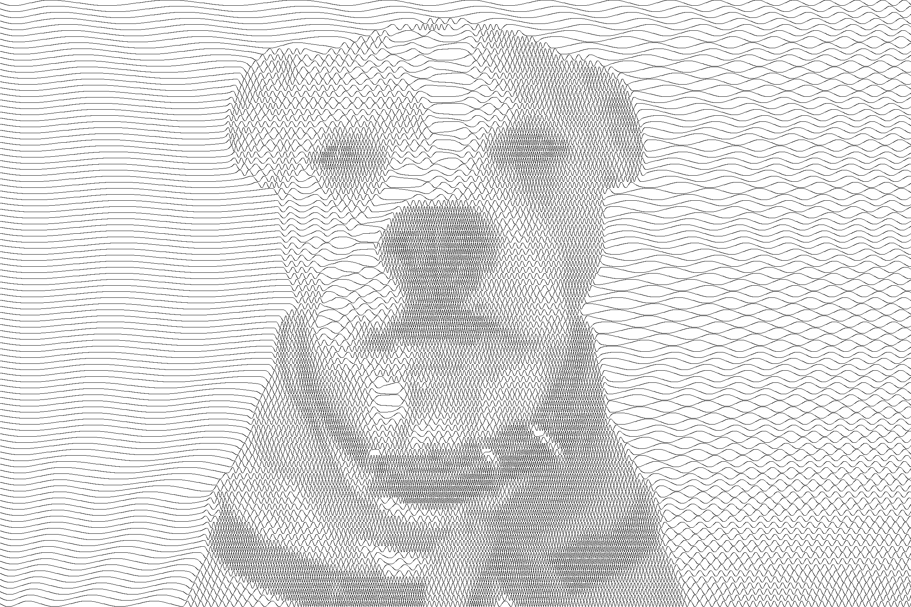

# Cosine Art

This is a script to create an image using frequency modulated sine waves, given an input image. Here is an example image transformation:


 

It just uses numpy to process the image pixel by pixel. The image is first converted to greyscale followed by subsampling across columns (decrease the number of rows). This results in a pixel averaged image with less number of rows but the same number of pixels as the original image. The pixel values of a particular row act as the frequencies with which we modulate the waveform of that  row. Each row containing the sine wave is of the same width with which we initially subsampled the image. For each row, we calculate the sine values as we progress from left to right in that row. The continuity is brought in by tracking the phase of wave as we move. Thus the position of wave at index `i` in the row will be `a sin(phi + f[i])` where `a` is the row width, `phi` is the phase till index `i-1` and `f[i]` is the intensity at index `i`. Using this information we plot each row. There is some interpolation involved and some constant factors multiplied to get the desired range for everything.

## Usage
The usage is as follows:
```bash
python3 cosine_art.py [options] input
```
All the command line options are as follows:
```
positional arguments:
  input                 path to input image

optional arguments:
  -h, --help            show this help message and exit
  -o OUTPUT_FILE, --output-file OUTPUT_FILE
                        path to output image
  -c WAV_COLOR, --wav-color WAV_COLOR
                        color of the waveforms. It could either be a code in
                        the format e.g. #FF00FF or one of [black, white, red,
                        green, blue, yellow]
  -b BACKGROUND_COLOR, --background-color BACKGROUND_COLOR
                        background color, for fomart look at wav-color
  -w WIDTH, --width WIDTH
                        width of each waveform row in pixels
  -f {[0.,1.]}, --freq-factor {[0.,1.]}
                        frequency factor in range [0., 1.] for wavforms,
                        higher the number, more compact the wavs
  --invert              invert colors, so that dark goes to less frequency and
                        vice-versa
```

The script as run on one of the test images provided in `test_images`:
```bash
python3 cosine_art.py test_images/test_image_1.jpg
```

## Formats supported
As of now, jpeg, png are supported, without any exhaustive testing. In case of any issues, or if you want more formats supported, create an issue.

## Test Image credits
Both test images are taken from [unsplash.com](unsplash.com). `test_image_1.jpg` is a photo by [taylor hernandez](https://unsplash.com/@taylormae), and `test_image_2.jpg` is by [Shelley Kim](https://unsplash.com/@shelleykim).
